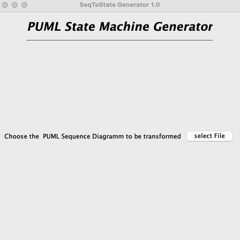
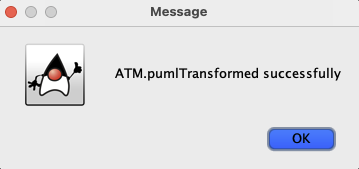

# UML-Diagram-Transformer-From-Sequence-to-State

## Project Overview

UML diagram conversion using the Java-based UML Diagram Transformer, a significant application that converts UML sequence diagrams to state machine diagrams utilising PlantUML syntax. This application simplifies the intricate process of diagram conversion, facilitating a deeper understanding of system dynamics through automatic transformation.

## Key Features

* **Automated Conversion:** Effortlessly transforms UML sequence diagrams into state machine diagrams, enhancing clarity and understanding of system behaviors.

* **PlantUML Integration:**  Utilizes the powerful plantuml-1.2022.12.jar for precise diagram generation, ensuring high-quality visuals and accurate representations.

* **User-Friendly Interface:**  Designed with ease of use in mind, featuring a straightforward GUI for an intuitive conversion experience.

## How to Use 

1.  **Setup:**  Ensure the plantuml-1.2022.12.jar file is integrated into your project environment for full functionality.

2.  **Conversion:** Provide a UML sequence diagram in PlantUML syntax (e.g., depicting an ATM transaction process). The tool will then automatically generate a corresponding state machine diagram in PlantUML syntax, facilitating an enhanced understanding of system states and transitions.

* **Step 1:** Provide a UML sequence diagram in PlantUML syntax

```
@startuml
Client -> ATM : Insert ATM card
Client <- ATM : Request PIN
Client -> ATM : Enter PIN code
ATM -> Bank : verify PIN code
Bank -> ATM : PIN Valid
Client <- ATM : Request amount
Client -> ATM : Enter amount
ATM -> Bank : Process transaction
ATM <- Bank : Transaction successful
Client <- ATM : Dispense cash
Client <- ATM : print receipt

@enduml
```
If you have installed the [plantUML](https://plantuml.com) extension in your code editor. We may preview the sequence diagram, which will look like this. 


* **Step 2:** Run the programme MainFenster.java, and we'll get this window.



Select the sequence puml file. (E.g., ATM.puml).  After that you will receive a the following window that the state digrams were successful and the files have been saved in the (ZustandDiagramm) folder.



in the ZustandDiagramm folder a ATM.png & ATM.txt will appeare. 
